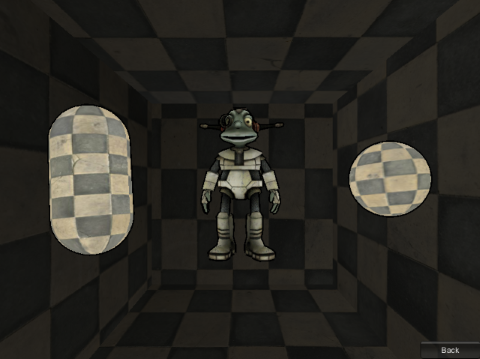

HalPlayground
=============

A sandbox to test and share some Unity 3D samples

--------

Demo
===

Take a look on our [live demo](https://rawgithub.com/giacomelli/HalPlayground/master/src/HalPlayground/Players/Web/HalPlayground/HalPlayground.html).

---------

Features
===
 - Toys (aka: samples)
 	- Auto deform mesh
 	
	

 	- Bolt particle system
 	
	

 	- Cell shading
 	
 	

 	- Fireball particle system
 	
	

 	- Mesh deformation
 	
	

 	- Morph
 	
	

 	- Neon particle system
 	
	
 
--------

Using
===
Starts scene Assets/Playground/PlaygroundScene to see all available toys or starts the scenes inside each Assets/Toys subfolders to see a specific toy directly.

--------

Compatility
===
- Mac OSX
- Windows 7
- iOS

Roadmap
-------- 
 - Test on Android.
 - Add new toys.
 
--------

How to improve it?
======

Create a fork of [HalPlayground](https://github.com/giacomelli/HalPlayground/fork). 

Did you change it? [Submit a pull request](https://github.com/giacomelli/HalPlayground/pull/new/master).

License
======

Licensed under the The MIT License (MIT).
In others words, you can use this library for developement any kind of software: open source, commercial, proprietary and alien.

Change Log
======
 - 0.0.1 First version.
